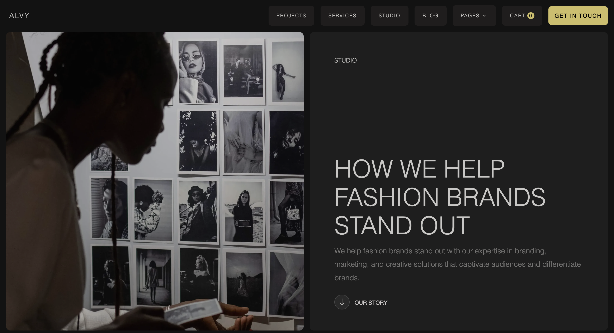

## 📷 Alvy Website Screenshot



## Alvy Website

🚀 **First Responsive Project!**

A fully **responsive website** built using **HTML, CSS, and SCSS**, with flexible layouts, media queries, and adaptive design for different screen sizes.

---

## 🌐 Live Demo
[https://dev-hamza03.github.io/alvy-website/](https://dev-hamza03.github.io/alvy-website/)

---

## 💻 Repository
[https://github.com/dev-hamza03/alvy-website](https://github.com/dev-hamza03/alvy-website)

---

## 🛠️ Features
- Fully **responsive layout** for desktop, tablet, and mobile.
- Built with **HTML, CSS, and SCSS**.
- Modern **flexbox-based design**.
- Clean and simple navigation.
- Sections for **team, services, projects, and contact**.

---

## 📁 Folder Structure
```
alvy-website/
│
├─ index.html
├─ README.md
├─ style.css
├─ style.scss
├─ assets/
│  ├─ images/
│  └─ fonts/
```

---

## 📚 What I Learned
- Using **media queries** effectively.
- Creating **flexible layouts** with **flexbox**.
- Importance of **adaptive typography and spacing**.
- Organizing CSS with **SCSS mixins** for cleaner code.

---

## 🔗 Connect
- Twitter/X: [@dev-hamza03](https://twitter.com/dev-hamza03)  
- GitHub: [dev-hamza03](https://github.com/dev-hamza03)

---

**Note:** This project is a learning experience. Feedback and suggestions are welcome! 💪
